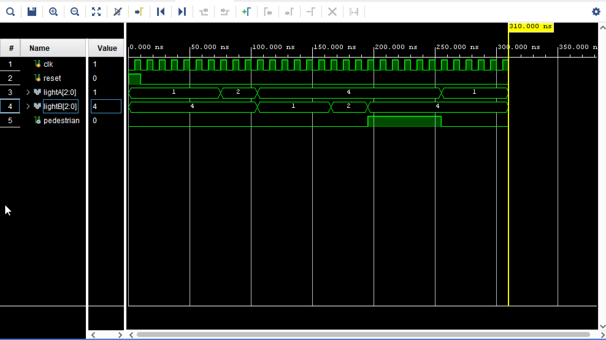

# Traffic-Light-Controller
# 🚦 Traffic Light Controller (Verilog - Vivado)

## 📌 Description
This project implements a Traffic Light Controller using Verilog HDL in Vivado.

## ⚙️ Features
- FSM-based design
- Automatic traffic control for two roads
- Pedestrian crossing state (both lights RED)
- Clean and synchronous design

## 🔁 FSM States
- S0: A Green, B Red
- S1: A Yellow, B Red
- S2: A Red, B Green
- S3: A Red, B Yellow
- S4: Both Red + Pedestrian ON

## 🧪 Simulation
- Verified using Vivado simulator
- Waveform included

## 📷 Output Waveform

## 🛠️ Tools Used
- Verilog HDL
- Xilinx Vivado

## 👨‍💻 Author
Nitin
